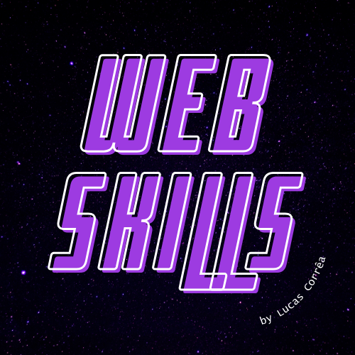

  

<h1 align="center">
  Web Skills
</h1>

<!-- criar licença -->
<!--  -->

 

_The repository focused on studying components for Front-End course_

- skills em general 
- good habits
- practical examples

_Exemplos práticos de como utilizar._

## 🍰 Contributing

Please contribute using [GitHub Flow](https://guides.github.com/introduction/flow). Create a branch, add commits, and [open a pull request](https://github.com/lucascorreaa/web-skills/compare).

_created by Lucas Correa_ 🔐